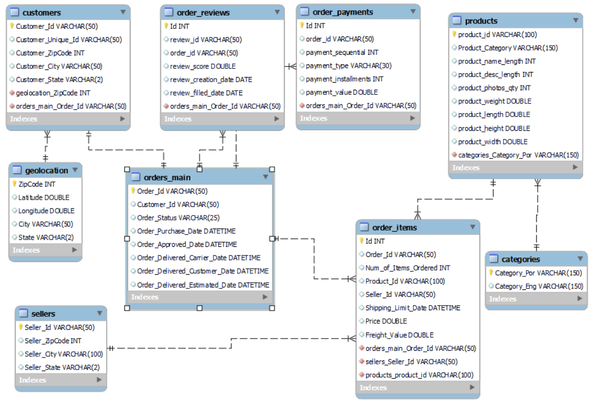

# Brazilian E-Commerce Public Dataset by Olist

I was hired by [Olist](https://olist.com/pt-br/) to create a database for their Brazillian E-Commerce public data and conduct preliminary analysis regarding some of the topics they were interested in. Fresh copies of these data files can be downloaded from [Kaggle](https://www.kaggle.com/olistbr/brazilian-ecommerce). 

This data primarily contains the orders made at the Olist store and has information on more than 100,000 orders made between 2016 and 2018 in Brazil. 

It allows for viewing the data from multiple dimensions, such as product categories, payments, sellers, and reviews provided by the customers. The data is supplemented by the geolocation of the customers. However, the data has been anonymized to protect consumers and sellers. 

My goal was to first create a central data warehouse using different datasets provided by the organization and then create data marts for my analytics. The process can be defined using the following:

## Creation of the Operational Layer:

I first created the database/schema Brazillian_Olist and used it for my further working. In this database, I created different tables for each datafile I received from the company, defined my columns, and then loaded the data into individual tables.
Before loading, 3 of the csv data files needed some cleaning so I performed a few cleaning operations using Excel. The changes made to each of these data files before loading are as follows:
 
**1-	Customer file:**

   •	Converted the zip codes into integers as these were stored as strings. 
    
**2- Geolocation file:** 

   •	Deleted all the duplicate zip code values as the file was supposed to give unique zip codes for geographical breakdowns in Brazil. 
      The data was collected from multiple sources, hence contained duplicate values for zip codes with slight variations in latitude and longitude, 
      which signified the different centroid considered by each data provider.
      
   •	some entries in column 'city' included state and country name with commas to separate it, even though the column only needed city name. 
      So, I split the column using Excel, based on the comma in the same column and deleted the city and country name extracted from this column as 
      state was already given in the ‘state’ column.
    
   •	Converted the zip codes into integers in Excel as it was initially stored as a string.
    
**3- Order_Reviews file:**

   •	Deleted the ‘Review_Comment’ & ‘Review_Title’ column since I won't be doing sentiment analysis based on the wordings.

## ANALYTICS: 

Once I loaded the tables into the database, I used the reversed engineering option to pre-populate the tables in the EER diagram. I then created links between the tables as per the data in individual tables. 
The tables were then joined to create the Olist_DW data warehouse. Using this data warehouse, I then created multiple data mart views to answer some of the analytical questions.
Table Descriptions:

1-	Customers: The table contains information on customer id and their location. Customer_id is the primary key in this table. 

2-	Order_Reviews: The table contains reviews provided by the customers for different orders and when these were filled. Since none of the columns had unique values, I created an auto-increment integer value as the primary key.

3-	Orders_Main: This contains information on the timings of when the orders were made and when the orders were delivered. Order_id is the primary key in this table.

4-	Order_Payments: The table contains information on how the payment was made and the value of the payment made.

5-	Order_Items: Contains information on product id, seller id, total price and freight value. Here as well, since there were no columns with unique values, I created an auto-increment integer as the primary key.

6-	Products: Contains details on the ordered product, such as its dimensions and category. The category here is given in Portuguese and hence this table will be joined with the Categories table to get the English translations of the product categories. The primary key in this table is product_id.

7-	Categories: This is a basic table with translations of the product categories into English. The primary key is product_category_por in this table.

8-	Sellers: Contains information on sellers, such as their location. The primary key in this table is the seller_id.

9-	Geolocation: The table contains unique zip codes for localities in Brazil along with other location columns. The primary key in this table is zipcodes. 

### Relationships:

1-	1:n between Geolocation and Customers table. Since there could be multiple customers ordering from the same zip code. The tables will be joined using zipcodes.

2-	1:n between the Customers and Orders_Main table. Since there could be multiple orders placed by the 1 customer. The tables will be joined using customer_id.

3-	1:n between Orders_Main and Order_Reviews table. As a customer could order multiple items in a single order and get multiple review forms for each product. The tables will be joined using order_id.

4-	1:n between Orders_Main and Order_Payments table. Since a customer had the option of paying for an order using a voucher and once of the other commonly used options such as credit card, cash etc. The tables will be joined using order_id. 

5-	1:n between Orders_Main and Order_Items table. Since a single order may contain more than 1 item/product. The tables will be joined on order_id.

6-	1:n between Sellers and Order_Items table. As a single seller might be fulfilling multiple order items. The tables will be joined on seller_id.

7-	1:n between Products and Orders_main table. As a single product might get ordered more than once. The tables will be joined on product_id.

8-	1:n between Categories and Products table. Since multiple products can fall under a single category. The tables will be joined using Category_por. 

### Database EER Diagram:

 
### Analytical Questions:

1-	Top 5 categories in terms of sales by year?

2-	Top 5 sellers by year?

3-	Top 5 sellers by average review score by year?

4-	Most famous payment type by year?

## ANALYTICAL LAYER:

For the analytical layer, I created the data warehouse and stored it into the table Olist_DW. The data warehouse contains specific fields from all the above listed tables. 
To create the data warehouse, I first created a procedure that would join the tables to create the data warehouse. However, due to the computational limitations of my machine, I had to divide the joining into two steps.
It first joins the tables Orders_Main, Customers, geolocation, and Order_Reviews and stores these in a table called Customer_Order_Main. Then it joins this Customer_Order_Main table with Payments, Order_Items, sellers, and products to create the final Olist_DW datawarehouse. Finally, after creating the data warehouse, it deletes the temporary table Customer_Order_Main to decrease the load on the server. 
A quick snapshot of the data warehouse table is as follows.
 

## DATA MART:

For final analytics of the data provided I have created 4 views as data marts, each answering a question provided by the company.

**1-	Categories_by_year**

This view contains product_category, order_purchase_date which is used to transform and create a new additional column called order_purchase_year, order_id and order_status for each product enabling the analysts to draw analysis on best performing products by year. The view contains filtered data on the products that have been delivered to the customers.

It also answers the following question.

**Top 5 categories in terms of sales by year?**

I have created a procedure (categories_by_year) here that allows the analysts to enter a specific year when calling the procedure and get the top 5 best performing products by counting the instances of each product ordered. 

 
**2-	Seller_by_year**

This view contains order_id, seller_id, order_purchase_date which is used to transform and create a new additional column called order_purchase_year where the products are delivered to the customers. The view can be used by the analysts to get information on top sellers by year.

It answers the following question in this case.

**Top 5 sellers by year?**

I have created a procedure (sellers_by_year) here that allows the analysts to enter a specific year when calling the procedure and get the top 5 best performing sellers in terms of orders delivered by counting the order ids. 

 
**3-	Sellers_by_Review**

This view contains order_id, seller_id, year(review_filled_date) as review_filled_year , review_score, and review_id. This contains products without any restriction on delivery status as the review is only generated after the product has been delivered or cancelled.

This view can be used by the analysts to get stats on sellers based on the reviews provided by the costumers.

It answers the following question in this case.

**Top 5 sellers by average review score by year?**

I have created a procedure (sellers_by_review) that gives the average review score of each seller and then provides us with the top 5 sellers based on the reviews provided in each year. The analysts can enter a specific year when calling the procedure to get year wise top 5 sellers list by average review score.

**4-	Payment_by_Year**
This view contains order_id, year(order_purchase_date) as payment_year, and payment_type. The goal of this view is to allow the analysts to identify the commonly used payment methodologies, in case the company needs to focus on certain types of payment types.

It answers the following question in this case.
**Most famous payment type by year?**

I have created a procedure (payment_by_year) that gives the payment methodologies based on the count of each payment methodology in each year. The analysts can enter a specific year when calling the procedure to get year wise top payment types used by the customers.

## The Complete script of the project can be accessed [here](Individual_Project_Script.sql)
