## Introduction 

### Dataset selection  

We have selected a dataset called [World University Ranking](https://www.kaggle.com/mylesoneill/world-university-rankings) from Kaggle to perform analytics using KNIME. This dataset has 6 tables, however we have shortlisted two that had relational elements and would serve a purpose in our analytics; Education Expenditure (as a percentage of GDP) and Times Data (University Ranking). 

The Education Expenditure table contains a list of countries along with their spending on education as a percentage of GDP. This is further bifurcated based on level of education (higher education and elementary education) and type of spending (total, public, private). This is available for multiple years, however, we have focused on the year 2011 as its corresponding data is available in the Times Data table.  

The education expenditure table is relevant as it represents expenditure as a percentage of gross domestic product for each country. Times Data table highlights the world university ranking. Times higher education ranking is widely regarded as one of the most influential ratings providers for universities globally. It uses multiple parameters to analyze a university’s performance, which are part of the times data table as well, such as students to staff ratio, percentage of international students, and male to female ratio. 

One question these tables help answer is the proportions of public and private spending towards elementary and higher education in the country. We have created an interactive Sun Chart in Knime that helps visualize it easily. 

Another question this dataset answers is the link between the percentage of international students in a university and its World ranking. To answer this question, we have created a Bar Chart in Knime.  

### MySQL Data Warehouse 

The project uses MySQL Workbench to load the Times Data and Education Expenditure data into two separate SQL tables. These two tables are then joined to create the Educ_DW data warehouse that is linked to Knime for further analysis. 

An EER diagram is created based on these linkages, as shown below. The Educ_DW EER diagram is supplemented by two more tables (Country Codes, World Bank API) that are joined with the Educ_DW in Knime. Hence, the following EER summarizes the overall relationship between the tables used in the project. 

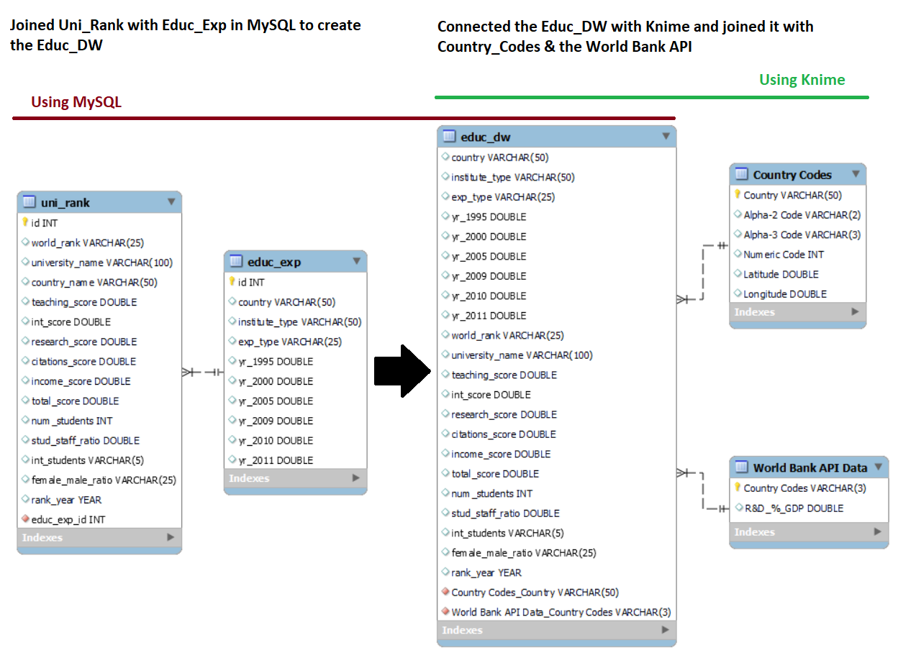 

### World Bank API 

We have used the World Bank [API](https://data.worldbank.org/indicator/GB.XPD.RSDV.GD.ZS?view=chart) that pulls Research & Development spending of a country as a percentage of its GDP, for the year 2011. The year 2011 is specifically chosen to maintain correspondence with the information available in our main table (World University Ranking). This is the API [URL](http://api.worldbank.org/v2/country/all/indicator/GB.XPD.RSDV.GD.ZS?format=json&date=2011). 

The goal of using this API data is to check if there exists any relationship between the university rankings of a country with its R&D spending as a percentage of the GDP. 

### ETL in KNIME 

The reader will find below all the information regarding each node used by the team. It includes the reason for choosing the node, any configurations made, how is the node serving a purpose in our analytics. Certain nodes are used to construct a set of nodes that form a workflow annotation. Each workflow annotation has a couple of nodes that are part of a process, for example ‘Data Cleaning.’  

#### a) Reading the dataset from MYSQL 

The first workflow annotation which includes two nodes is the starting point of our ETL pipeline in KNIME. To be able to perform analytics we are using the MySQL connector node to connect with MySQL. The next node which is the DB Query Reader enabled us to read the data table (Educ_DW) from MySQL to KNIME. The screenshot below gives a preview of the data table that was previously joined in MySQL. It includes many relevant columns such as expenditure type, years, and university name but also some poorly formatted information for some variables that we will clean in the Data Cleaning workflow annotation. 

We have used the File Reader node to upload the Country Codes csv file which we obtained from [GitHub](https://gist.github.com/tadast/8827699). This file contains the codes for each country as the ‘Alpha-2 code’ column and we add it as another column in our main data table (Educ_dw) alongside country names. These were joined using a left outer join.  

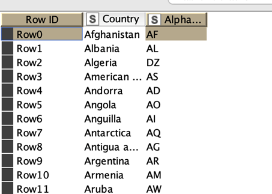

#### b) Data Cleaning 

The data was cleaned for the column female to male ratio as the entries made in the column were in different formats, such as, 2:3, 4.16 etc.
  
So we converted these different formats into percentages to make it easier for us to use it ahead in the project.

  ##### Path 1
  ##### - Rule-based row filter to split datatable into 2 tables, by identifying ":" sign in the values
  ##### - String manipulation to drop the ":xx" part of the ratio, transforming "30:70" to "30"
  ##### - String to number to convert to number

  ##### Path 2
  ##### - Rule-based row filter to split datatable into 2 tables, by identifying ":" sign
  ##### - String manipulation to remove "-", used as NA
  ##### - String to number to convert to number
  ##### - Column expresion, to calculate integers into a percentage of females (from 2.71 to 73%)
  ##### Rejoining A and B paths
  ##### - Filtering out columns not needed
  
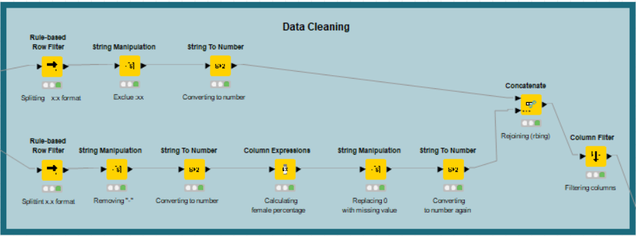

#### c) Joiner 

This node joins the Country codes table with the Educ_DW table sourced from the SQL database. The reason of joining these two tables is to allow us to join the Educ_DW with the World Bank API. The two tables are joined on the country name using a left outer join. 

#### d) String Manipulation 

Created a [URL](http://api.worldbank.org/v2/country/all/indicator/GB.XPD.RSDV.GD.ZS?format=json&date=2011) containing the [API](https://data.worldbank.org/indicator/GB.XPD.RSDV.GD.ZS?view=chart) with proper country codes.  This node joins together the above joined Educ_DW table with the API on the 2-digit country codes.  

#### e) Group By 

This node groups the rows based on the 2-digit country codes and the URL. Following are the grouped columns.  

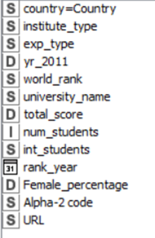

#### f) Missing Value 

Since we had a few missing values, we used the Missing Value node to remove the rows that contained missing values. 

#### g) Get request 

 This node loads the API in KNIME. We now have the country codes and the URL for the API for each country. 

#### h) Container Output 

This node is created to be able to view the entire JSON file and if needed, export the loaded data.  

#### i) JSON path 

This node is used to extract the values of R&D as a percentage of GDP. 

#### j) Column filter  

This node is used to filter out the columns that are not required for our analysis. Following is the list of columns that we have carried forward.  

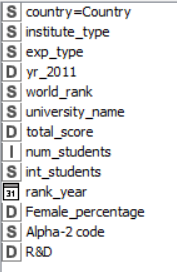

### Visualization 1: University World Ranking by % of International Students 

The purpose of this workflow is to answer the question of what the link is between the percentage of international students in a university and its World ranking? 

#### a) String Manipulation 

The column int_students was stored as a string variable as it contained the symbol ‘%’ in the values. The first string manipulation node removes the ‘%’ sign and converts the column into an integer variable so that it can be used in visualization ahead. 

The second string manipulation node converts the world_rank column into a double as it is also stored as a string. The purpose of this is to utilize this in the visualization ahead by creating bins. 

The third string manipulation converts the % of female column into a double so it can be charted. 

The row filter node only includes higher education institutions for the charts ahead.

#### b) Numeric Binner	 

This node is used to create manual bins for the world_rank column. It is done to make sure the final bar chart is visually appealing to the viewer. Following are the bins. 

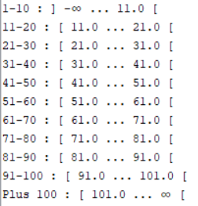

#### c) Bar Charts 

The first bar chart node creates a bar chart of percentage of international students in a university vs its World ranking. 

A general trend is visible from the chart where top universities have more international students compared to low rated universities. However, whether there is a correlation between these two variables cannot be defined from this chart as further analysis will be required to determine such a relationship. 
 
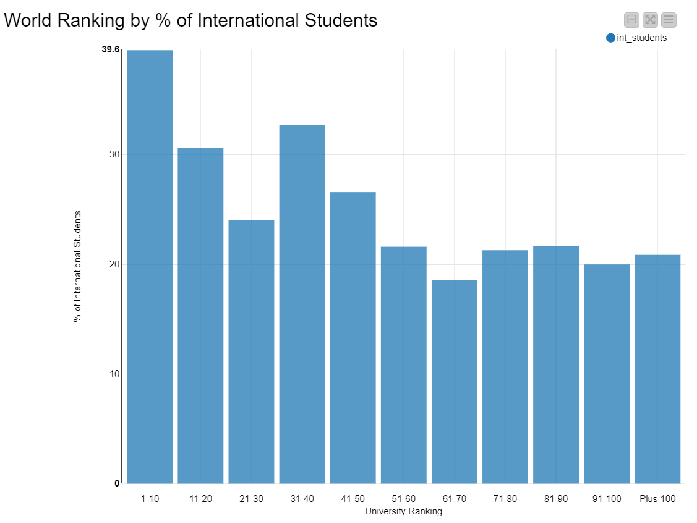

The second bar chart node creates a bar chart of percentage of female students in a university vs its World ranking. 

There is no clear trend in the chart, however, it seems like high ranked universities have lower percentage of females compared to lower ranked universities.

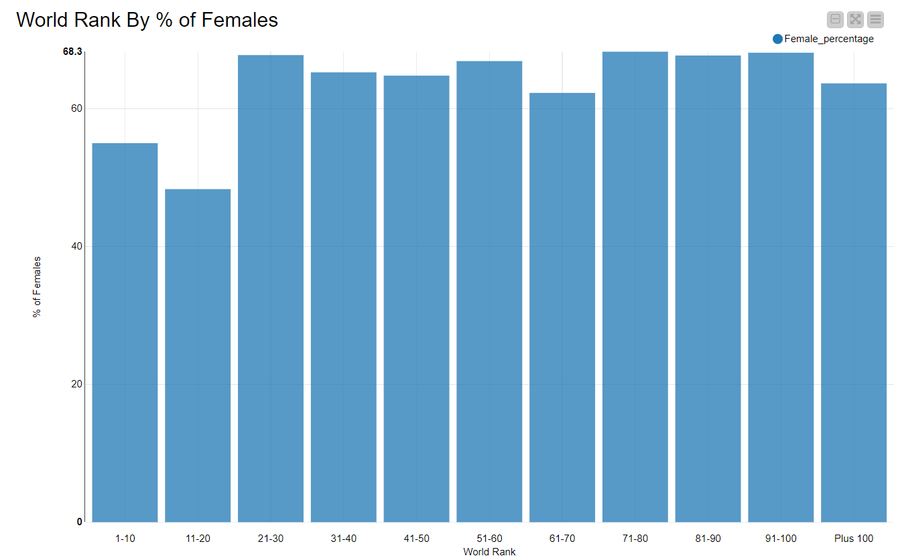

### Visualization 2: Government Spending on Education  

The purpose of this workflow is to answer the question of, depending on the type of institution, what was the percentage of public or private expenditure by each country in the year 2011? 

#### a) Row Filter 

There are two row filter nodes in this workflow. This first node filters out the rows that contain data for ‘All Institutions’ category and the second node filters out the ‘Total’ category.  

The first row filter excludes the ‘Total Expenditure’ so we can select either ‘Private Expenditure’ or ‘Public Expenditure’ in the final chart. The second row filter node excludes the ‘total’ so we can select ‘Higher Education’ or ‘Elementary or Secondary Education’ in our chart.  

#### b) Group By 

This node groups the following columns for the visualization ahead.  
 
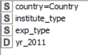

#### c) Sunburst Chart 

This node creates a Sunburst Chart to visualize the percentage of public or private expenditure by each country in the year 2011. This is an interactive chart to let the viewer have freedom in bisecting the public vs private spending in elementary vs higher education. 

The innermost circle shows all the countries. Starting from the countries that spent the most in a clockwise direction. Then we can select the type of institution and finally either public or private spending as a percentage of the country’s GDP. This is all done by hovering the mouse over each fragment and based on the hover, the results are displayed on the top left corner. For example, the following image shows the results for public spending in New Zealand for elementary schools and secondary schools. 

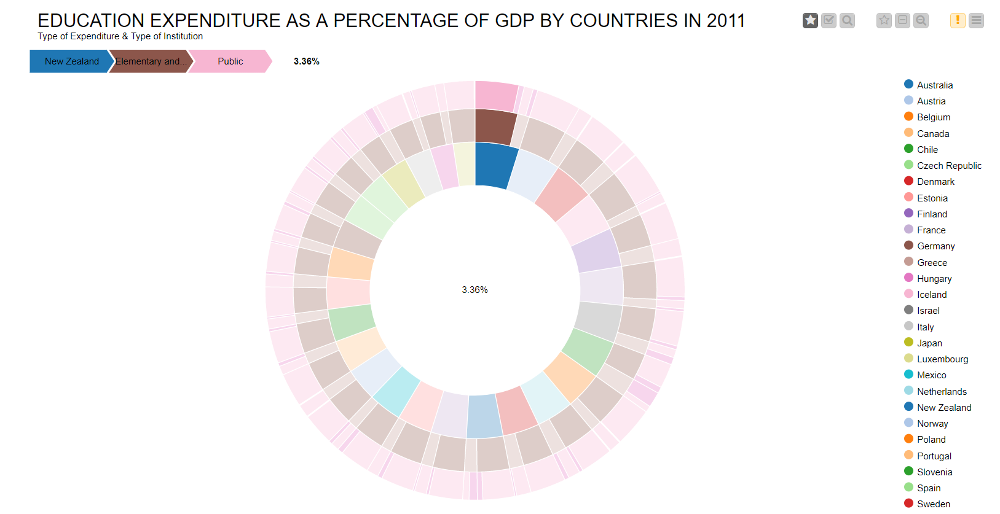

### Visualization 3: Government spending on R&D as a % of GDP to Total Scores of Universities 

The purpose of this node is to answer the question, how are the research and development expenditure of the country and the university score connected? 

#### a) Group By 

This node groups the columns shown below. 

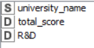

#### b) Scatter Plot 

This node is used to create a quick scatter plot of the two above-mentioned variables before running a regression. It seems difficult to extract a clear relationship from the scatter plot as total, hence, we went forward with the regression analysis.  

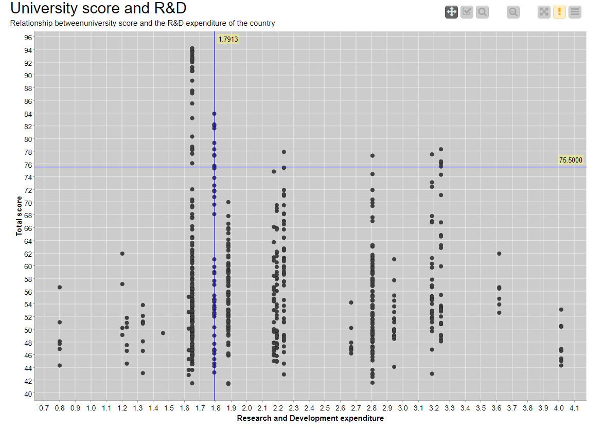 

The scatter plot below has Total Score on the y-axis where a higher total score translates into a better ranking. The x-axis gives the R&D expenditure as a percentage of GDP. 

#### c) Linear Regression Learner 

We want to see if there is a relationship between a country’s R&D expenditure as a percentage of GDP and the total score received by universities from Times. 

We ran the following equation in the simple OLS regression.  

Total score = alpha + beta * R&D 

Plugging in the values, this becomes: Total score = 59.2 - 1.2 * R&D 

As we can see from the table, the model’s R-square is low. The beta coefficient is –1.69 which suggest a negative relationship contrary to our hypothesis, however, it is not significant (P-value ~0.28) so we cannot reject that the coefficient is zero. Thus, there is no meaningful relationship between the R&D expenditure as a percentage of GDP and the total score received by a university.  

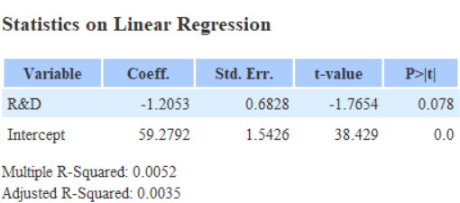

In the regression plot below, we have Total Score on the y-axis where a higher total score translates into a better ranking. The x-axis gives the R&D expenditure as a percentage of GDP. 
 
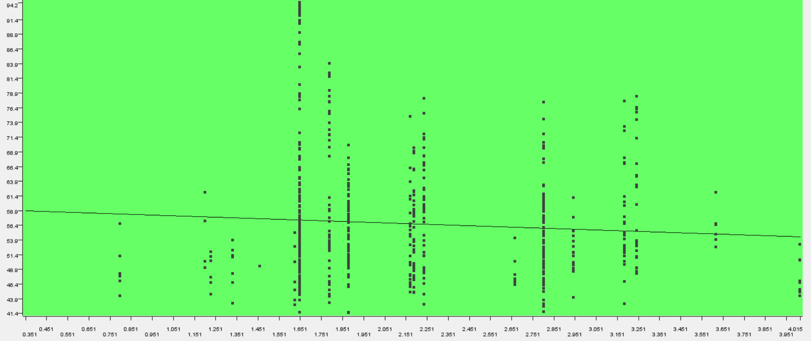

### Team Members’ Contributions: 

#### Aftab Alam 

 - Loaded the datasets in SQL and created the data warehouse to be used in Knime 

 - Data visualization number 1: University World Ranking by % of International Students 

 - Project documentation 

 - Project compilation and pushing it to Git 

#### Daniel Gyebnar 

 - Data cleaning in Knime to fix the female to male ratio column 

 - Project presentation slides 

#### Gyongyver Kamenar 

 - Connected the SQL data warehouse to Knime 

 - Found the country codes on Git and connected it to the data warehouse in Knime 

 - Found the World Bank API and loaded it in Knime 

 - Data visualization number 3: Government spending on R&D as a % of GDP to Total Scores of Universities 

#### Nawal Zehra Hasan 

 - Found the university ranking dataset 

 - Connected the SQL data warehouse to Knime 

 - Connected the country codes to the data warehouse in Knime 

 - Loaded the API in Knime 

 - Data visualization number 2: Government Spending on Education 

 

 
